## 실습 1 실습 결과 (2026.08.24)

이번 실습에서는 Node.js와 VS Code를 준비한 뒤 Vue 3와 Vite를 이용해 skala-vue 프로젝트를 생성했습니다. 필요한 패키지를 설치하고 개발 서버를 실행해 브라우저에 초기 화면이 정상적으로 나타나는 것을 확인했습니다.

프로젝트가 만들어진 후에는 src 폴더 안에 있는 components, views, router, stores 등을 살펴보았습니다. Vue 프로젝트를 처음 만들어 보았기 때문에 여러 파일과 생성 과정이 낯설었지만, 기본 구조가 미리 만들어져 있어 각 파일이 어디에 사용되는지 찾아보기는 편했습니다. Router 설정을 통해 Home 화면과 About 화면이 각각의 경로에 연결되어 있는 것도 확인했습니다.

이후 교수님께서 안내해 주신 실습 내용에 따라 About 페이지와 Vue Devtools를 열고 AboutView 컴포넌트를 확인했습니다. VS Code에서 AboutView.vue의 화면 내용에 평소 좋아하는 CORTIS의 REDRED 문구를 추가한 뒤 저장하자, 브라우저를 새로고침하지 않았는데도 내용이 바로 바뀌었습니다. Vue Devtools의 Components 탭에서도 AboutView가 다시 렌더링되는 것을 보면서 HMR이 실제로 어떻게 동작하는지 확인할 수 있었습니다.

Vue Devtools에서는 Components 탭뿐만 아니라 Router 탭에서 현재 화면과 연결된 컴포넌트를 확인했으며, Pinia와 Timeline, Assets, Graph 메뉴도 차례로 살펴보았습니다. 아직 모든 기능을 직접 사용해 보지는 못했지만, 컴포넌트의 상태나 이벤트 흐름, 라우팅 정보를 확인할 때 사용하는 도구라는 점을 알게 되었습니다.

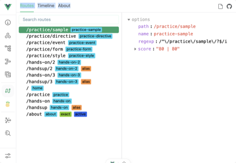

이번 실습을 통해 Vue 프로젝트를 생성하고 실행하는 기본 과정을 따라 해 보았고, 소스를 수정한 결과가 HMR을 통해 즉시 반영되는 것도 확인했습니다. 특히 화면만 확인하고 끝낸 것이 아니라 Vue Devtools에서 실제 컴포넌트와 라우팅 상태까지 함께 살펴본 점이 이번 실습의 주요 결과였습니다.

실습에 사용한 파일 위치는 다음과 같습니다.

- AboutView 컴포넌트 : src/views/AboutView.vue

## 실습 2 실습 결과 (2026.08.25)

이번 실습에서는 날씨 데이터를 카드 형태로 보여주는 Mockup을 만들었습니다. 도시별 기온과 날씨를 배열로 만들고 반복 출력했으며, 25도를 기준으로 더움과 선선함을 나누었습니다. 검색창에 입력한 도시명을 바로 보여주고, 카드 선택과 상세보기 기능도 추가했습니다. 주어진 예제에서 제주 날씨를 하나 더 넣어 데이터를 직접 늘려 보았습니다.

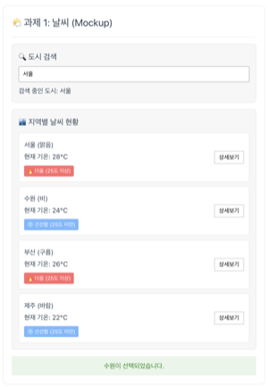

가장 기억에 남은 부분은 카드 안의 상세보기 버튼이었습니다. 버튼을 누를 때 부모 카드의 클릭까지 같이 실행될 수 있어 @click.stop을 사용했습니다. 실습 전에는 이벤트 버블링이 어떤 상황에서 문제가 되는지 잘 느끼지 못했는데, 버튼과 카드에 각각 클릭 기능을 넣으면서 왜 필요한지 이해할 수 있었습니다.

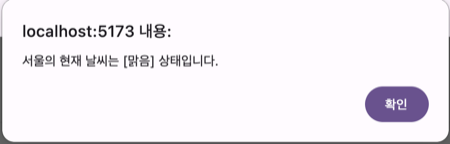

도시 검색창을 만들 때 처음에는 input의 :value만 searchCity에 연결했습니다. 글자를 입력해도 searchCity값이 바뀌지 않아 화면에 도시명이 출력되지 않았습니다. 교재 내용을 다시 보고 @input에서 event.target.value를 searchCity에 넣도록 수정하자 입력한 한글 도시명이 바로 표시되었습니다. 이 과정을 통해 v-model이 value 바인딩과 input 이벤트 처리를 한 번에 해준다는 것을 이해할 수 있었습니다.

이번 실습에서는 입력값이 바뀌거나 카드를 눌렀을 때 화면이 바로 달라지는 과정이 가장 재미있었습니다. 예제 코드를 따로따로 실행했을 때보다 날씨 화면 하나를 직접 만들어 보니 Vue의 데이터와 화면이 어떻게 연결되는지 좀 더 쉽게 이해할 수 있었습니다.

실습에 사용한 파일 위치는 다음과 같습니다.

- 날씨 Mockup 컴포넌트: src/components/practices/hands_on2/Weather.vue

## 실습 3 실습 결과 (2026.08.25)

PDF 과제에서는 실습 2의 검색어, 선택 도시, 날씨 배열을 반응형 상태로 유지하면서 computed로 검색 결과를 만들고 watch와 watchEffect로 변화를 확인하도록 요구했습니다. 검색어가 없을 때, 일치할 때, 일치하는 도시가 없을 때의 화면을 구분하고 개인 반응형 기능도 추가하는 것이 과제 내용이었습니다. 실습 2 코드를 복사해 이 조건을 추가했고, 지역 데이터도 인천, 대전, 대구, 광주, 울산, 강릉을 더해 총 10개로 늘렸습니다.

검색어를 입력하면 watchEffect가 즉시 반응하고, 날씨 카드를 선택하면 watch가 이전 값과 변경된 값을 콘솔에 보여주도록 했습니다. 둘이 비슷해 보였지만 watch는 감시할 대상을 직접 정하고, watchEffect는 함수 안에서 사용한 값을 자동으로 추적한다는 차이를 콘솔 변화로 확인했습니다.

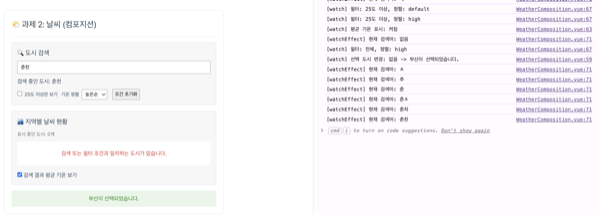

추가 기능으로 25도 이상만 보기, 기온순 정렬, 평균 기온, 조건 초기화를 넣었습니다. 처음에 평균 기온을 검색된 전체 데이터로 계산해서 25도 이상만 보기를 선택해도 평균값은 그대로인 문제가 있었습니다. 평균 계산이 화면에 최종으로 표시되는 도시 목록을 기준으로 하도록 바꾸자 필터와 함께 정상적으로 달라졌습니다. computed는 결과뿐만 아니라 어떤 반응형 데이터를 참조하는지도 중요하다는 것을 알게 되었습니다.

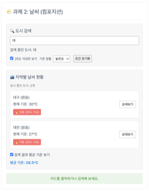

데이터가 10개로 늘어나니 검색과 정렬 결과가 바뀌는 모습을 확인하기 더 좋았습니다. 교재에서 각각 배웠던 계산된 속성과 감시자의 역할도 이번 화면에서 함께 사용해 보면서 이전보다 구분이 선명해졌습니다.

실습에 사용한 파일 위치는 다음과 같습니다.

- 날씨 Composition 컴포넌트: src/components/practices/hands_on3/WeatherComposition.vue

## 실습 4 실습 결과 (2026.08.26)

실습 4는 실습 3의 날씨 코드를 가져온 뒤 기능은 그대로 유지하면서 컴포넌트를 분리하는 과제였습니다. PDF에서 요구한 대로 반응형 데이터와 computed, watch는 WeatherParent에 두고, 공통 박스와 검색창, 날씨 카드를 BaseDashboardCard, SearchBar, WeatherCard로 나누었습니다. 각 컴포넌트에서 사용하는 디자인도 해당 파일의 scoped style로 옮겼습니다.

BaseDashboardCard에는 slot을 두어 같은 박스 디자인 안에 도시 검색과 날씨 목록을 각각 넣었습니다. SearchBar는 부모의 검색어를 props로 받아 보여주고, 입력값이 바뀌면 update-query 이벤트로 다시 부모에게 전달하도록 했습니다. WeatherCard도 도시 객체를 props로 받은 뒤 카드 선택과 상세보기 클릭을 각각 select-card와 click-detail 이벤트로 올려보냈습니다. 교재에서 배운 데이터는 부모에서 자식으로, 이벤트는 자식에서 부모로 전달된다는 구조를 실제 코드 분리에 적용해 볼 수 있었습니다.

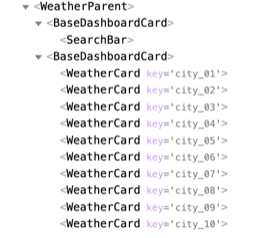

처음에는 추가 기능인 필터, 정렬, 평균 기온을 하나의 컴포넌트로 묶었습니다. 실행에는 문제가 없었지만 그냥 여러 기능을 한 파일에 모은 것이라 컴포넌트를 추가한 이유가 분명하지 않았습니다. 그래서 완성도를 위해 해당 파일을 원래대로 돌려놓고 기존 alert 상세보기를 WeatherDetailModal로 바꾸었습니다. 부모가 선택한 날씨 객체를 모달에 전달하고, 닫기 버튼이나 바깥 영역을 누르면 close 이벤트를 보내도록 하니 역할이 더 명확해졌습니다.

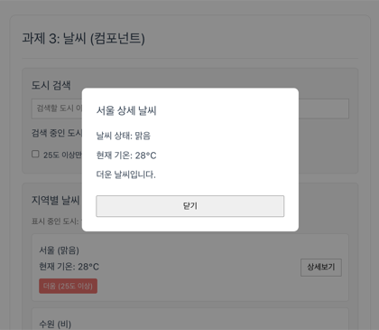

컴포넌트를 나눈 뒤에도 실습 3에서 만든 도시 검색, 25도 이상 필터, 기온 정렬, 평균 기온, 조건 초기화가 그대로 동작하는지 다시 확인했습니다. 한 파일에 모든 화면과 로직이 있을 때보다 파일 수는 늘었지만, 검색 입력이나 카드 디자인처럼 수정할 위치를 찾기는 더 쉬웠습니다.

실습에 사용한 파일 위치는 다음과 같습니다.

- 부모 날씨 컴포넌트: src/components/practices/hands_on4/WeatherParent.vue
- 공통 박스 컴포넌트: src/components/practices/hands_on4/BaseDashboardCard.vue
- 도시 검색 컴포넌트: src/components/practices/hands_on4/SearchBar.vue
- 날씨 카드 컴포넌트: src/components/practices/hands_on4/WeatherCard.vue
- 상세보기 모달 컴포넌트: src/components/practices/hands_on4/WeatherDetailModal.vue

## 실습 5 실습 결과 (2026.08.26)

실습 5는 실습 4의 날씨 컴포넌트를 복사한 뒤 Vue Router를 적용하는 과제였습니다. PDF에서는 라우터 지연 로딩과 Catch-all Route를 설정하고, 날씨 홈과 소개, 동적 상세 페이지를 각각 View 컴포넌트로 만들도록 요구했습니다. 추가 View도 하나 필요해 날씨 상태를 정리한 안내 페이지를 만들었습니다. 기존 프로젝트의 Home 경로를 유지해야 했기 때문에 날씨 페이지는 /hands-on/5 아래에서 이동하도록 구성했습니다.

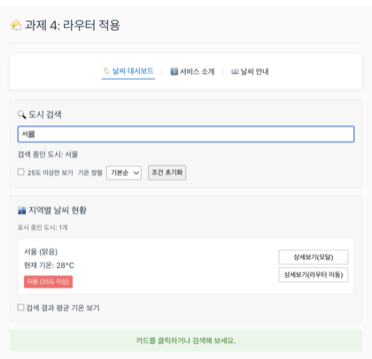

WeatherHomeView에는 실습 4의 검색, 필터, 정렬, 평균 기온과 모달 기능을 그대로 옮겼습니다. 날씨 카드의 버튼은 상세보기(모달)와 상세보기(라우터 이동)로 나누었습니다. 라우터 이동 버튼을 누르면 useRouter의 push로 도시 코드가 포함된 주소로 이동하고, WeatherDetailView에서는 useRoute로 cityId를 받은 뒤 onMounted에서 해당 도시의 Mock Data를 찾도록 했습니다. 상세 화면에는 기온뿐만 아니라 체감 기온, 습도, 풍속, 강수량도 표시했습니다.

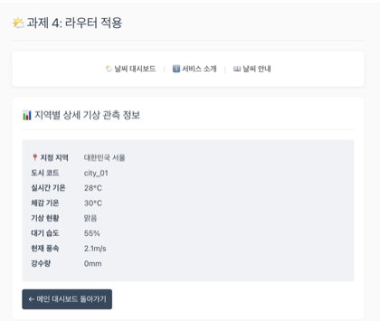

존재하지 않는 주소는 Catch-all Route가 처리하지만, /hands-on/5/weather/city_99처럼 형식은 맞고 도시 코드만 잘못된 주소는 이미 동적 경로와 일치하므로 Catch-all로 넘어가지 않았습니다. 이 경우 Mock Data 검색 결과가 없기 때문에 WeatherDetailView에서 별도로 확인하고 도시 정보를 찾지 못했다는 문구와 대시보드 이동 링크를 보여주도록 처리했습니다. 이를 통해 경로 자체가 없는 경우와 동적 파라미터의 값이 잘못된 경우는 따로 처리해야 한다는 점을 알게 되었습니다.

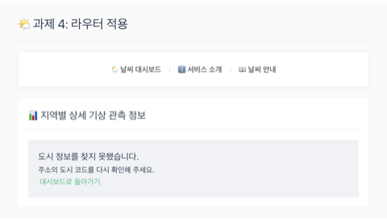

그 밖에 검색어는 URL의 search 값과 동기화해 새로고침 후에도 같은 검색 결과가 유지되도록 했습니다. 소개 페이지에는 실습용 부품 연동과 화면 전환 방식을 정리하고 대시보드로 돌아가는 링크를 넣었습니다.

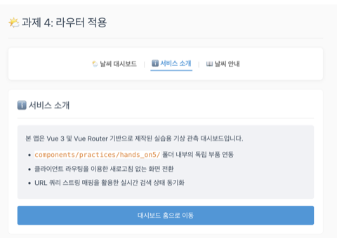

존재하지 않는 주소는 Catch-all Route를 통해 NotFoundView가 표시되도록 했습니다.

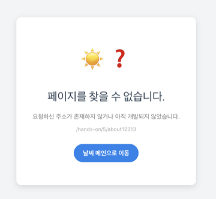

처음 한 화면에서만 사용하던 날씨 기능을 여러 URL로 나누어 보니 components는 화면 안에서 재사용되는 부품이고 views는 주소와 직접 연결되는 페이지라는 차이가 더 분명하게 느껴졌습니다.

실습에 사용한 파일 위치는 다음과 같습니다.

- 날씨 대시보드 페이지: src/views/hands_on5/WeatherHomeView.vue
- 상세 기상관측 페이지: src/views/hands_on5/WeatherDetailView.vue
- 서비스 소개 페이지: src/views/hands_on5/WeatherAboutView.vue
- 추가 날씨 안내 페이지: src/views/hands_on5/WeatherGuideView.vue
- 잘못된 경로 페이지: src/views/hands_on5/NotFoundView.vue
- 공통 날씨 페이지 헤더: src/components/practices/hands_on5/WeatherPageHeader.vue
- 날씨 카드 컴포넌트: src/components/practices/hands_on5/WeatherCard.vue
- 라우터 설정: src/router/index.js
