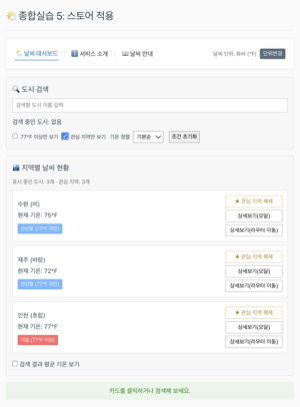
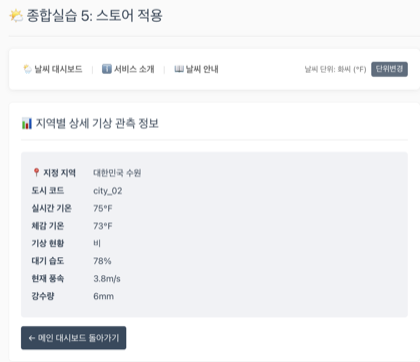
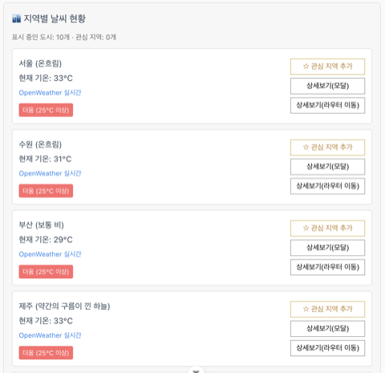
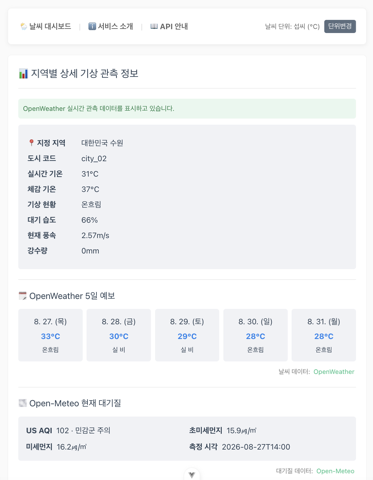
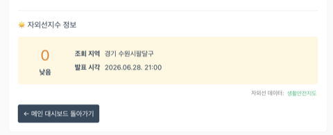
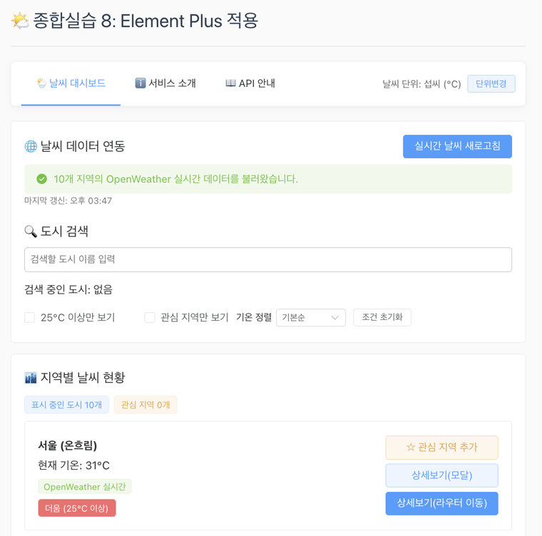
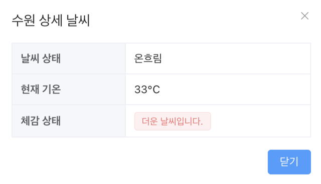
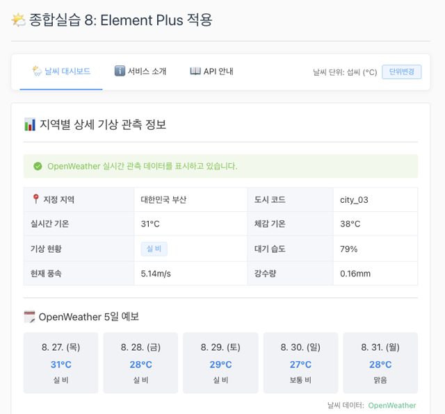

## 실습 1 실습 결과 (2026.08.24)

이번 실습에서는 Node.js와 VS Code를 준비한 뒤 Vue 3와 Vite를 이용해 skala-vue 프로젝트를 생성했습니다. 필요한 패키지를 설치하고 개발 서버를 실행해 브라우저에 초기 화면이 정상적으로 나타나는 것을 확인했습니다.

프로젝트가 만들어진 후에는 src 폴더 안에 있는 components, views, router, stores 등을 살펴보았습니다. Vue 프로젝트를 처음 만들어 보았기 때문에 여러 파일과 생성 과정이 낯설었지만, 기본 구조가 미리 만들어져 있어 각 파일이 어디에 사용되는지 찾아보기는 편했습니다. Router 설정을 통해 Home 화면과 About 화면이 각각의 경로에 연결되어 있는 것도 확인했습니다.

이후 교수님께서 안내해 주신 실습 내용에 따라 About 페이지와 Vue Devtools를 열고 AboutView 컴포넌트를 확인했습니다. VS Code에서 AboutView.vue의 화면 내용에 평소 좋아하는 CORTIS의 REDRED 문구를 추가한 뒤 저장하자, 브라우저를 새로고침하지 않았는데도 내용이 바로 바뀌었습니다. Vue Devtools의 Components 탭에서도 AboutView가 다시 렌더링되는 것을 보면서 HMR이 실제로 어떻게 동작하는지 확인할 수 있었습니다.

Vue Devtools에서는 Components 탭뿐만 아니라 Router 탭에서 현재 화면과 연결된 컴포넌트를 확인했으며, Pinia와 Timeline, Assets, Graph 메뉴도 차례로 살펴보았습니다. 아직 모든 기능을 직접 사용해 보지는 못했지만, 컴포넌트의 상태나 이벤트 흐름, 라우팅 정보를 확인할 때 사용하는 도구라는 점을 알게 되었습니다.

이번 실습을 통해 Vue 프로젝트를 생성하고 실행하는 기본 과정을 따라 해 보았고, 소스를 수정한 결과가 HMR을 통해 즉시 반영되는 것도 확인했습니다. 특히 화면만 확인하고 끝낸 것이 아니라 Vue Devtools에서 실제 컴포넌트와 라우팅 상태까지 함께 살펴본 점이 이번 실습의 주요 결과였습니다.

실습에 사용한 파일 위치는 다음과 같습니다.

- AboutView 컴포넌트 : src/views/AboutView.vue

## 실습 2 실습 결과 (2026.08.25)

이번 실습에서는 날씨 데이터를 카드 형태로 보여주는 Mockup을 만들었습니다. 도시별 기온과 날씨를 배열로 만들고 반복 출력했으며, 25도를 기준으로 더움과 선선함을 나누었습니다. 검색창에 입력한 도시명을 바로 보여주고, 카드 선택과 상세보기 기능도 추가했습니다. 주어진 예제에서 제주 날씨를 하나 더 넣어 데이터를 직접 늘려 보았습니다.

가장 기억에 남은 부분은 카드 안의 상세보기 버튼이었습니다. 버튼을 누를 때 부모 카드의 클릭까지 같이 실행될 수 있어 @click.stop을 사용했습니다. 실습 전에는 이벤트 버블링이 어떤 상황에서 문제가 되는지 잘 느끼지 못했는데, 버튼과 카드에 각각 클릭 기능을 넣으면서 왜 필요한지 이해할 수 있었습니다.

도시 검색창을 만들 때 처음에는 input의 :value만 searchCity에 연결했습니다. 글자를 입력해도 searchCity값이 바뀌지 않아 화면에 도시명이 출력되지 않았습니다. 교재 내용을 다시 보고 @input에서 event.target.value를 searchCity에 넣도록 수정하자 입력한 한글 도시명이 바로 표시되었습니다. 이 과정을 통해 v-model이 value 바인딩과 input 이벤트 처리를 한 번에 해준다는 것을 이해할 수 있었습니다.

이번 실습에서는 입력값이 바뀌거나 카드를 눌렀을 때 화면이 바로 달라지는 과정이 가장 재미있었습니다. 예제 코드를 따로따로 실행했을 때보다 날씨 화면 하나를 직접 만들어 보니 Vue의 데이터와 화면이 어떻게 연결되는지 좀 더 쉽게 이해할 수 있었습니다.

실습에 사용한 파일 위치는 다음과 같습니다.

- 날씨 Mockup 컴포넌트: src/components/practices/hands_on2/Weather.vue

## 실습 3 실습 결과 (2026.08.25)

PDF 과제에서는 실습 2의 검색어, 선택 도시, 날씨 배열을 반응형 상태로 유지하면서 computed로 검색 결과를 만들고 watch와 watchEffect로 변화를 확인하도록 요구했습니다. 검색어가 없을 때, 일치할 때, 일치하는 도시가 없을 때의 화면을 구분하고 개인 반응형 기능도 추가하는 것이 과제 내용이었습니다. 실습 2 코드를 복사해 이 조건을 추가했고, 지역 데이터도 인천, 대전, 대구, 광주, 울산, 강릉을 더해 총 10개로 늘렸습니다.

검색어를 입력하면 watchEffect가 즉시 반응하고, 날씨 카드를 선택하면 watch가 이전 값과 변경된 값을 콘솔에 보여주도록 했습니다. 둘이 비슷해 보였지만 watch는 감시할 대상을 직접 정하고, watchEffect는 함수 안에서 사용한 값을 자동으로 추적한다는 차이를 콘솔 변화로 확인했습니다.

추가 기능으로 25도 이상만 보기, 기온순 정렬, 평균 기온, 조건 초기화를 넣었습니다. 처음에 평균 기온을 검색된 전체 데이터로 계산해서 25도 이상만 보기를 선택해도 평균값은 그대로인 문제가 있었습니다. 평균 계산이 화면에 최종으로 표시되는 도시 목록을 기준으로 하도록 바꾸자 필터와 함께 정상적으로 달라졌습니다. computed는 결과뿐만 아니라 어떤 반응형 데이터를 참조하는지도 중요하다는 것을 알게 되었습니다.

데이터가 10개로 늘어나니 검색과 정렬 결과가 바뀌는 모습을 확인하기 더 좋았습니다. 교재에서 각각 배웠던 계산된 속성과 감시자의 역할도 이번 화면에서 함께 사용해 보면서 이전보다 구분이 선명해졌습니다.

실습에 사용한 파일 위치는 다음과 같습니다.

- 날씨 Composition 컴포넌트: src/components/practices/hands_on3/WeatherComposition.vue

## 실습 4 실습 결과 (2026.08.26)

실습 4는 실습 3의 날씨 코드를 가져온 뒤 기능은 그대로 유지하면서 컴포넌트를 분리하는 과제였습니다. PDF에서 요구한 대로 반응형 데이터와 computed, watch는 WeatherParent에 두고, 공통 박스와 검색창, 날씨 카드를 BaseDashboardCard, SearchBar, WeatherCard로 나누었습니다. 각 컴포넌트에서 사용하는 디자인도 해당 파일의 scoped style로 옮겼습니다.

BaseDashboardCard에는 slot을 두어 같은 박스 디자인 안에 도시 검색과 날씨 목록을 각각 넣었습니다. SearchBar는 부모의 검색어를 props로 받아 보여주고, 입력값이 바뀌면 update-query 이벤트로 다시 부모에게 전달하도록 했습니다. WeatherCard도 도시 객체를 props로 받은 뒤 카드 선택과 상세보기 클릭을 각각 select-card와 click-detail 이벤트로 올려보냈습니다. 교재에서 배운 데이터는 부모에서 자식으로, 이벤트는 자식에서 부모로 전달된다는 구조를 실제 코드 분리에 적용해 볼 수 있었습니다.

처음에는 추가 기능인 필터, 정렬, 평균 기온을 하나의 컴포넌트로 묶었습니다. 실행에는 문제가 없었지만 그냥 여러 기능을 한 파일에 모은 것이라 컴포넌트를 추가한 이유가 분명하지 않았습니다. 그래서 완성도를 위해 해당 파일을 원래대로 돌려놓고 기존 alert 상세보기를 WeatherDetailModal로 바꾸었습니다. 부모가 선택한 날씨 객체를 모달에 전달하고, 닫기 버튼이나 바깥 영역을 누르면 close 이벤트를 보내도록 하니 역할이 더 명확해졌습니다.

컴포넌트를 나눈 뒤에도 실습 3에서 만든 도시 검색, 25도 이상 필터, 기온 정렬, 평균 기온, 조건 초기화가 그대로 동작하는지 다시 확인했습니다. 한 파일에 모든 화면과 로직이 있을 때보다 파일 수는 늘었지만, 검색 입력이나 카드 디자인처럼 수정할 위치를 찾기는 더 쉬웠습니다.

실습에 사용한 파일 위치는 다음과 같습니다.

- 부모 날씨 컴포넌트: src/components/practices/hands_on4/WeatherParent.vue
- 공통 박스 컴포넌트: src/components/practices/hands_on4/BaseDashboardCard.vue
- 도시 검색 컴포넌트: src/components/practices/hands_on4/SearchBar.vue
- 날씨 카드 컴포넌트: src/components/practices/hands_on4/WeatherCard.vue
- 상세보기 모달 컴포넌트: src/components/practices/hands_on4/WeatherDetailModal.vue

## 실습 5 실습 결과 (2026.08.26)

실습 5는 실습 4에 이어서 Vue Router를 적용하는 과제였습니다. 교재에는 실습 5의 폴더 구조가 따로 제시되어 있었지만, 실습 4까지 진행하면서 추가 기능과 페이지 이동의 편의를 위해 지금의 폴더 구조를 미리 만들어 사용하고 있었습니다. 이미 작성한 실습들도 같은 구조로 정리되어 있어 교재의 폴더 배치를 그대로 따르지는 못했고, 기존 구조 안에 실습 5의 컴포넌트와 페이지를 추가하는 방식으로 진행했습니다.

폴더 위치는 교재와 다르지만 과제에서 요구한 라우터 지연 로딩과 Catch-all Route를 설정하고, 날씨 홈과 소개, 동적 상세 페이지를 각각 View 컴포넌트로 만들었습니다. 추가 View로는 날씨 상태를 정리한 안내 페이지를 만들었으며, 기존 프로젝트의 Home 경로를 유지하기 위해 날씨 페이지는 /hands-on/5 아래에서 이동하도록 구성했습니다.

WeatherHomeView에는 실습 4의 검색, 필터, 정렬, 평균 기온과 모달 기능을 그대로 옮겼습니다. 날씨 카드의 버튼은 상세보기(모달)와 상세보기(라우터 이동)로 나누었습니다. 라우터 이동 버튼을 누르면 useRouter의 push로 도시 코드가 포함된 주소로 이동하고, WeatherDetailView에서는 useRoute로 cityId를 받은 뒤 onMounted에서 해당 도시의 Mock Data를 찾도록 했습니다. 상세 화면에는 기온뿐만 아니라 체감 기온, 습도, 풍속, 강수량도 표시했습니다.

존재하지 않는 주소는 Catch-all Route가 처리하지만, /hands-on/5/weather/city_99처럼 형식은 맞고 도시 코드만 잘못된 주소는 이미 동적 경로와 일치하므로 Catch-all로 넘어가지 않았습니다. 이 경우 Mock Data 검색 결과가 없기 때문에 WeatherDetailView에서 별도로 확인하고 도시 정보를 찾지 못했다는 문구와 대시보드 이동 링크를 보여주도록 처리했습니다. 이를 통해 경로 자체가 없는 경우와 동적 파라미터의 값이 잘못된 경우는 따로 처리해야 한다는 점을 알게 되었습니다.

그 밖에 검색어는 URL의 search 값과 동기화해 새로고침 후에도 같은 검색 결과가 유지되도록 했습니다. 소개 페이지에는 실습용 부품 연동과 화면 전환 방식을 정리하고 대시보드로 돌아가는 링크를 넣었습니다.

존재하지 않는 주소는 Catch-all Route를 통해 NotFoundView가 표시되도록 했습니다.

처음 한 화면에서만 사용하던 날씨 기능을 여러 URL로 나누어 보니 components는 화면 안에서 재사용되는 부품이고 views는 주소와 직접 연결되는 페이지라는 차이가 더 분명하게 느껴졌습니다.

실습에 사용한 파일 위치는 다음과 같습니다.

- 날씨 대시보드 페이지: src/views/hands_on5/WeatherHomeView.vue
- 상세 기상관측 페이지: src/views/hands_on5/WeatherDetailView.vue
- 서비스 소개 페이지: src/views/hands_on5/WeatherAboutView.vue
- 추가 날씨 안내 페이지: src/views/hands_on5/WeatherGuideView.vue
- 잘못된 경로 페이지: src/views/hands_on5/NotFoundView.vue
- 공통 날씨 페이지 헤더: src/components/practices/hands_on5/WeatherPageHeader.vue
- 날씨 카드 컴포넌트: src/components/practices/hands_on5/WeatherCard.vue
- 라우터 설정: src/router/index.js

## 실습 6 실습 결과 (2026.08.27)

과제에서는 configStore에 날씨 단위 상태와 단위 기호, 단위 전환 기능을 만들고 UnitToggler를 내비게이션 옆에 배치하도록 했습니다. 메인과 상세 화면의 기온도 선택한 단위에 맞게 바꾸고, 추가 Store 기능도 하나 작성해야 했습니다. NotFoundView는 전체 경로에서 함께 사용하는 화면이라 실습 6에 다시 만들지 않고 기존 실습 5의 전역 Catch-all 설정을 그대로 사용했습니다.

configStore에는 초기값이 celsius인 unit을 두고, unitSymbol에서 현재 상태에 맞는 ℃와 ℉를 계산했습니다. 단위변경 버튼을 누르면 toggleUnit이 값을 바꾸도록 했으며, 카드에서 단위를 바꾼 뒤 상세 페이지로 이동해도 같은 설정이 유지되는 것을 확인했습니다. 같은 값을 여러 컴포넌트에 props로 계속 전달하지 않아도 Store를 불러와 사용할 수 있다는 점이 이전 실습과 가장 크게 달랐습니다.

단위 변환을 카드와 모달에 먼저 적용한 뒤 확인해 보니 평균 기온과 상세 화면에는 섭씨가 그대로 남아 화면 안에서 단위가 섞여 보였습니다. 원본 데이터는 섭씨로 유지하고 각 화면에서 보여주는 값만 computed로 변환하도록 수정했습니다. 25도 이상 필터도 실제 비교는 원본 데이터로 처리하고, 화씨를 선택했을 때 화면의 기준 문구는 같은 온도인 77℉로 표시했습니다. 이후 카드, 평균 기온, 모달, 상세 화면의 현재 기온과 체감 기온이 한 번에 바뀌는 것을 확인했습니다.

추가 Store로는 관심 지역 기능을 만들었습니다. 카드에서 관심 지역을 추가하거나 해제하면 favoriteWeather에 도시 코드가 저장되고, getter로 등록된 지역 수를 계산해 대시보드에 표시했습니다. 등록만 하는 것으로는 활용이 부족해 관심 지역만 보기 조건도 추가했습니다. 이 조건을 켠 상태에서 관심 지역을 해제하면 해당 카드가 바로 목록에서 사라졌고, 조건 초기화를 누르면 일반 목록으로 돌아오도록 했습니다.

이번 실습에서는 state가 여러 화면에서 공유할 값, getter가 그 값을 이용해 계산한 결과, action이 상태를 변경하는 함수라는 구분을 실제 날씨 화면에 적용해 보았습니다. 특히 단위 설정처럼 페이지가 바뀌어도 같은 값을 사용해야 하는 경우에는 각 컴포넌트가 따로 상태를 가지는 것보다 Store로 관리하는 편이 더 알맞다는 것을 알게 되었습니다.

실습에 사용한 파일 위치는 다음과 같습니다.

- 날씨 단위 Store: src/stores/configStore.js
- 관심 지역 Store: src/stores/favoriteWeather.js
- 단위 전환 컴포넌트: src/components/practices/hands_on6/UnitToggler.vue
- 공통 날씨 페이지 헤더: src/components/practices/hands_on6/WeatherPageHeader.vue
- 날씨 카드 컴포넌트: src/components/practices/hands_on6/WeatherCard.vue
- 상세보기 모달 컴포넌트: src/components/practices/hands_on6/WeatherDetailModal.vue
- 날씨 대시보드 페이지: src/views/hands_on6/WeatherHomeView.vue
- 상세 기상관측 페이지: src/views/hands_on6/WeatherDetailView.vue
- 라우터 설정: src/router/index.js

## 실습 7 실습 결과 (2026.08.27)

교재 PDF에서는 OpenWeatherMap의 현재 날씨를 적용하고, OpenWeather에서 제공하는 API와 그 밖의 외부 API를 하나씩 더 사용해 기능을 확장하도록 했습니다. 이에 따라 현재 날씨와 5일 예보는 OpenWeather, 대기질은 Open-Meteo, 자외선지수는 생활안전지도 API를 이용했습니다.

API 호출 코드는 화면에서 분리해 서비스 파일로 만들었습니다. OpenWeather에서는 위도와 경도를 전달해 현재 기온, 체감 기온, 날씨 상태, 습도, 풍속과 강수량을 받아 기존 Mock Data 대신 표시했습니다. 추가 API로는 5일 예보를 연결해 날짜별 기온과 날씨 상태를 상세 페이지에서 확인할 수 있게 했습니다. API 키는 코드에 직접 적지 않고 .env.local에 저장했으며, 키가 없거나 호출에 실패하면 기존 날씨 데이터를 보여주도록 했습니다.

외부 API로 추가한 Open-Meteo에서는 지역 좌표를 이용해 현재 US AQI와 미세먼지, 초미세먼지 정보를 가져왔습니다. 날씨, 예보, 대기질, 자외선 API는 응답 속도와 실패 여부가 서로 다르기 때문에 Promise.allSettled로 함께 요청했습니다. 이 방식으로 자외선 API에 문제가 생겨도 현재 날씨와 대기질까지 모두 사라지지 않고, 실패한 부분에만 안내 문구가 나오도록 처리했습니다.

생활안전지도 자외선지수 API는 시군구 단위로 자료를 제공해 서울은 중구, 수원은 수원시팔달구처럼 각 도시 좌표에 맞는 대표 지역을 따로 연결했습니다. 처음에는 화면 제목을 현재 자외선지수라고 작성했지만, 응답에 포함된 발생일시를 확인해 보니 이 API는 실시간 값이 아니라 누적 자료를 제공하고 있었고 약 한,두 달 전 데이터가 포함되어 있었습니다. OpenWeather와 Open-Meteo에서 가져오는 값은 실시간이지만 자외선지수까지 현재 값처럼 보이면 혼동할 수 있어 제목을 자외선지수 정보로 바꾸고 발표 시각을 함께 표시했습니다. 외부 API 추가 요구사항에는 맞지만 실제 사용할 때는 데이터 시점을 반드시 확인해야 한다고 생각했습니다.

생활안전지도 키를 처음 넣었을 때는 resultCode 30과 함께 등록되지 않은 키라는 응답이 나왔습니다. 요청 주소와 serviceKey, pageNo, numOfRows, returnType을 공식 문서와 다시 비교한 뒤 같은 키로 재호출했을 때 resultCode 00과 269개의 시군구 자료가 정상적으로 반환되는 것을 확인했습니다. 또한 OPENAPI_KEY라는 이름은 Vite에서 기본적으로 클라이언트에 전달되지 않아 vite.config.js의 envPrefix에 OPENAPI_를 추가했습니다. 환경변수를 바꾼 뒤에는 개발 서버를 다시 실행해야 값이 적용되는 것도 확인했습니다.

이번 실습에서는 Axios가 응답의 JSON을 바로 객체로 사용할 수 있다는 점과 async/await로 통신 결과를 기다리는 과정을 실제 화면에서 확인했습니다. 이전 실습까지 사용했던 검색, 관심 지역, 온도 단위 변경과 라우터 이동은 그대로 유지하면서 데이터가 실제 API 응답으로 바뀌었고, 여러 API를 같이 사용할 때는 성공 화면뿐만 아니라 일부 요청이 실패했을 때의 처리도 중요하다는 것을 알게 되었습니다.

실습에 사용한 파일 위치는 다음과 같습니다.

- 현재 날씨와 예보 API: src/services/openWeatherApi.js
- 대기질 API: src/services/airQualityApi.js
- 자외선지수 API: src/services/uvIndexApi.js
- 도시별 좌표와 자외선 조회 지역: src/data/weatherCities.js
- 자외선지수 컴포넌트: src/components/practices/hands_on7/UvIndexPanel.vue
- 날씨 대시보드 페이지: src/views/hands_on7/WeatherHomeView.vue
- 상세 기상관측 페이지: src/views/hands_on7/WeatherDetailView.vue
- 서비스 소개 페이지: src/views/hands_on7/WeatherAboutView.vue
- 날씨 API 안내 페이지: src/views/hands_on7/WeatherGuideView.vue
- 환경변수 설정: vite.config.js
- 라우터 설정: src/router/index.js

## 실습 8 실습 결과 (2026.08.27)

실습 8에서는 외부 UI 라이브러리를 하나 선정해 이전 과제에 적용하는 것이 요구되었습니다. 실습 7에서 만든 날씨 대시보드를 복사한 뒤 Element Plus를 적용했습니다. 여러 라이브러리를 비교해 보았을 때 Element Plus가 데이터 중심 화면에 잘 맞고 배우기 어렵지 않았으며, 이번 날씨 화면에 필요한 카드, 버튼, 메뉴, 모달 같은 부품도 한 번에 제공하고 있어 선택했습니다.

패키지를 설치한 뒤 main.js에서 Element Plus의 공통 CSS를 불러왔습니다. 라이브러리 전체를 전역으로 등록하는 대신 각 파일에서 필요한 컴포넌트만 가져와 사용했습니다. 대시보드의 검색 조건은 Checkbox, Select, Switch로 바꾸고 날씨 카드에는 Card와 Tag를 적용했습니다. 검색 결과가 없을 때는 Empty를 보여주고 평균 기온은 Statistic으로 표시했습니다. 기존에 직접 만들었던 상세보기 모달도 Dialog와 Descriptions를 사용하도록 바꾸어 닫기 동작과 정보 구분이 더 분명하게 보이도록 했습니다.

상세 페이지에는 현재 날씨와 대기질 정보를 Descriptions로 정리하고, API 요청을 기다리는 동안에는 Skeleton이 나타나도록 했습니다. API 요청 성공 여부는 Alert로 구분했으며 잘못된 도시 주소로 들어간 경우에는 Result를 표시했습니다. 실습 7에서 연결한 현재 날씨, 5일 예보, 대기질, 자외선지수 API와 온도 단위 변경, 관심 지역 기능은 그대로 유지했습니다.

처음에는 도시 검색창도 Element Plus의 Input으로 변경했습니다. 그런데 한글로 대를 입력했을 때 검색 결과가 바로 바뀌지 않고 스페이스바를 한 번 눌러야 반영되는 문제가 있었습니다. 실시간 검색은 입력하는 동안 결과가 달라지는 것이 더 중요하다고 생각해 이 부분만 실습 7에서 사용한 기본 input으로 되돌렸습니다. 그 뒤에는 대를 입력하는 시점에 대전과 대구가 바로 표시되었습니다. UI 라이브러리를 사용하면 모양을 통일하기는 편하지만, 모든 요소를 무조건 교체하는 것이 사용하기 좋은 화면을 만드는 것은 아니라는 점을 확인했습니다.

Element Plus를 적용하면서 직접 작성했던 버튼과 카드 스타일이 줄어들고 화면의 색상과 간격도 전보다 일정해졌습니다. 특히 모달, 로딩 상태, 검색 결과 없음처럼 직접 처리할 내용이 많은 부분은 라이브러리 컴포넌트를 사용하는 편이 편했습니다. 반대로 검색창처럼 기존 동작이 더 자연스러운 부분은 원래 방식을 유지하는 것이 낫다고 판단했습니다.

실습에 사용한 파일 위치는 다음과 같습니다.

- Element Plus 설정: src/main.js
- 날씨 대시보드 페이지: src/views/hands_on8/WeatherHomeView.vue
- 상세 기상관측 페이지: src/views/hands_on8/WeatherDetailView.vue
- 서비스 소개 페이지: src/views/hands_on8/WeatherAboutView.vue
- API 및 UI 안내 페이지: src/views/hands_on8/WeatherGuideView.vue
- 공통 날씨 페이지 헤더: src/components/practices/hands_on8/WeatherPageHeader.vue
- 도시 검색 컴포넌트: src/components/practices/hands_on8/SearchBar.vue
- 날씨 카드 컴포넌트: src/components/practices/hands_on8/WeatherCard.vue
- 상세보기 모달 컴포넌트: src/components/practices/hands_on8/WeatherDetailModal.vue
- 자외선지수 컴포넌트: src/components/practices/hands_on8/UvIndexPanel.vue
- 라우터 설정: src/router/index.js

## 실습 9 실습 결과 (2026.08.27)

실습 9에서는 ESLint로 소스 코드를 점검하고 API 키를 환경변수로 관리한 뒤, 프로젝트를 빌드하여 서버에 호스팅하는 것이 과제였습니다. 실습 8의 날씨 화면이 이번 빌드와 배포의 대상이지만 새 화면이나 기능을 추가하는 내용은 없었습니다. 같은 코드를 hands_on9 폴더에 다시 복사하면 내용이 완전히 중복되기 때문에 별도의 실습 9 화면은 만들지 않고 기존 프로젝트 전체를 점검했습니다.

프로젝트를 처음 만들 때 ESLint, Oxlint, Prettier를 함께 설치해 두었고 package.json에도 lint와 format 명령이 이미 등록되어 있었습니다. 이전 실습을 진행할 때도 코드를 수정한 뒤 린트와 빌드를 계속 확인했기 때문에 이번에 npm run lint를 실행했을 때 141개 파일에서 경고와 오류가 나오지 않았습니다. 실습 9에서 새로 고친 코드가 없는 이유는 품질 검사를 생략한 것이 아니라, 앞선 실습 과정에서 오류가 생길 때마다 바로 수정해 둔 결과였습니다.

API 키 관리도 실습 7에서 실제 날씨 API를 연결하면서 미리 적용한 부분이었습니다. OpenWeather 키와 생활안전지도 키는 소스에 직접 작성하지 않고 .env.local에 저장했으며, 서비스 파일에서는 import.meta.env를 통해 값을 읽도록 했습니다. .gitignore의 *.local 규칙 때문에 해당 파일은 GitHub에 올라가지 않습니다. Vercel에서도 GitHub에 없는 환경변수를 사용할 수 있도록 프로젝트 설정에 같은 이름의 환경변수를 별도로 등록했습니다.

npm run build를 실행한 결과 1842개의 모듈이 변환되었고 dist 폴더에 HTML, JavaScript, CSS 정적 파일이 생성되었습니다. 교재에서 설명한 것처럼 빌드 결과의 파일명에는 해시값이 붙었으며, 소스의 Vue 파일은 브라우저가 실행할 수 있는 형태로 변환되어 있었습니다. 이후 GitHub 저장소를 Vercel에 연결해 빌드를 진행했고 배포가 완료된 뒤 제공된 주소에서 날씨 화면이 정상적으로 열리는 것을 확인했습니다.

이번 실습에서는 새 기능을 만드는 것보다 이전에 설정해 둔 내용이 배포 과정에서 어떤 역할을 하는지 확인했습니다. 특히 로컬의 .env.local은 GitHub에 포함되지 않으므로 Vercel 환경변수는 따로 설정해야 한다는 점이 중요했습니다. 개발 중에 린트와 빌드를 미리 확인해 둔 덕분에 마지막 단계에서 코드를 다시 고치지 않고 그대로 배포할 수 있었습니다.

실습에 사용한 파일 위치는 다음과 같습니다.

- ESLint 설정: eslint.config.js
- Oxlint 설정: .oxlintrc.json
- Prettier 설정: .prettierrc.json
- 품질 검사와 빌드 명령: package.json
- 환경변수 제외 설정: .gitignore
- 환경변수 접두사 설정: vite.config.js
- OpenWeather API 환경변수 사용: src/services/openWeatherApi.js
- 생활안전지도 API 환경변수 사용: src/services/uvIndexApi.js
- 빌드 및 배포 대상 화면: src/views/hands_on8/WeatherHomeView.vue
